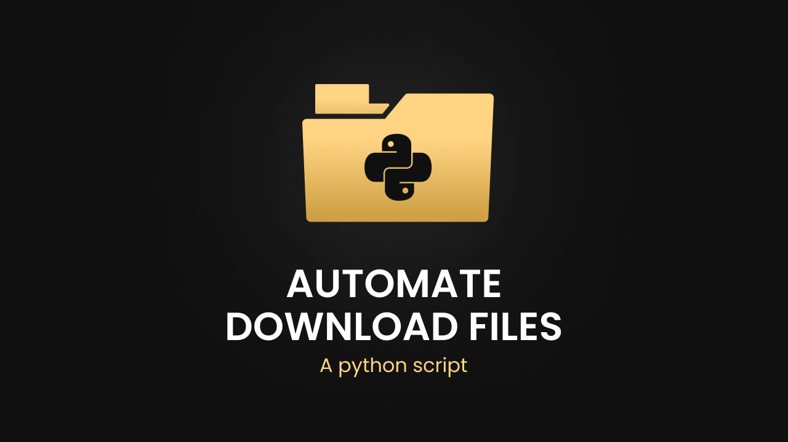

# Automate Download Files

<br>
This Python script automates the process of redirecting files from the downloads folder to another folder designated for specific extensions.

## How It Works

1. The script monitors the downloads folder for any new files.
2. When a new file is detected, it checks its file extension.
3. Based on the file extension, it moves the file to the corresponding folder designated for that extension.

## Usage

1. Clone or download the repository to your local machine.
2. Install the required dependencies:

```bash
pip install watchdog
```

3. Modify the script to specify the directories where your downloads and destination folders are located.
4. Run the script:

```bash
python automate_download_files.py
```

## Customization

You can customize the script by:

- Modifying the source and destination directories.
- Adding or removing file extensions and their corresponding destination folders.

## Requirements

- Python 3.x
- Watchdog library

## License

This repository is licensed under the MIT License. See `LICENSE` for more information.
